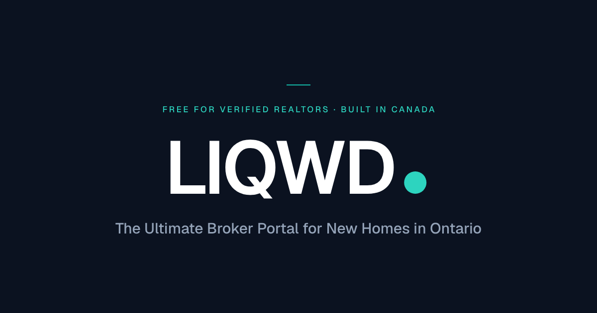

<p align="center">
  
</p>

# LIQWD

The ultimate broker portal for new homes in Ontario. Free for verified
realtors. Built in Canada.

A login-protected broker portal plus a public, SEO-friendly lead surface, built
on a normalized Supabase Postgres backend that keeps broker-only data private.

## Stack

- **Next.js 16** (App Router, Server Components, Server Actions)
- **TypeScript**
- **Tailwind CSS v4**
- **Supabase** — Postgres, Auth, Storage, RLS (`@supabase/ssr`)

## Getting started

```bash
npm install
cp .env.local.example .env.local   # then fill in real values
npm run dev
```

Open http://localhost:3000.

### Environment variables

See `.env.local.example`. The service-role key is **server-only** and must
never be exposed to the client.

| Variable | Scope |
|----------|-------|
| `NEXT_PUBLIC_SUPABASE_URL` | public |
| `NEXT_PUBLIC_SUPABASE_ANON_KEY` | public |
| `SUPABASE_SERVICE_ROLE_KEY` | server only (bypasses RLS) |

## Database

All schema, RLS, storage, and seed scripts live in [`supabase/`](./supabase).
Run them in order in the Supabase SQL Editor — see
[`supabase/README.md`](./supabase/README.md) for run order, the one-time admin
bootstrap, and required dashboard actions.

## Project structure

```
src/
├── app/
│   ├── (marketing)/         # public landing + public project pages (SEO + leads)
│   ├── (auth)/              # login, signup, forgot/reset password
│   ├── auth/                # callback + signout route handlers
│   ├── dashboard/           # protected realtor workspace
│   │   ├── projects/        # browse + realtor (broker-only) project detail
│   │   ├── submit/          # new property submission
│   │   ├── verify/          # RECO verification flow
│   │   └── profile/         # profile & settings
│   └── not-found.tsx        # custom 404
├── components/              # ui primitives, marketing, dashboard
├── lib/
│   ├── supabase/            # client / server / admin / session helpers
│   ├── auth.ts              # profile bootstrap + role/verification helpers
│   ├── brand.ts             # approved marketing copy
│   └── types.ts             # schema-aligned TS types
└── proxy.ts                 # auth session refresh + /dashboard route guard
```

## Brand assets

Logo and banner files live in [`public/brand/`](./public/brand). All SVGs are
self-contained (letterforms outlined from Geist, the site typeface) and use the
design tokens from `src/app/globals.css`.

| File | Use |
|------|-----|
| `liqwd-logo.svg` | Horizontal lockup (ink + teal dot) for light backgrounds |
| `liqwd-logo-white.svg` | Lockup for dark backgrounds |
| `liqwd-mark.svg` | Square app-icon / avatar mark |
| `liqwd-banner.svg` / `liqwd-banner.png` | 1200×630 social / Open Graph banner |

## Security model

- Public pages read **only** from the public-safe views (`public_projects_view`,
  `public_realtor_cards`) and `is_public`/`is_active`-gated rows — never the raw
  private tables.
- Broker-only data (commissions, broker portals, restricted incentives/docs) is
  gated behind **approved** verification status and enforced by RLS.
- Admin areas and review queues are admin-only (RLS + app guards).
- The service-role client (`src/lib/supabase/admin.ts`) is `server-only` and
  never imported into client code.

## Status

Core product complete: auth, profile bootstrap + verification gating, landing
page, dashboard shell, protected routes, project browsing + detail (broker-only
views), public project pages with lead capture, the new-property submission
flow, and the **admin review console** (verification / submission / update-request
queues, approve-reject-needs-changes actions, canonical project editing, and
public-page publish/unpublish controls). Admin areas are admin-only via RLS +
app guards.
